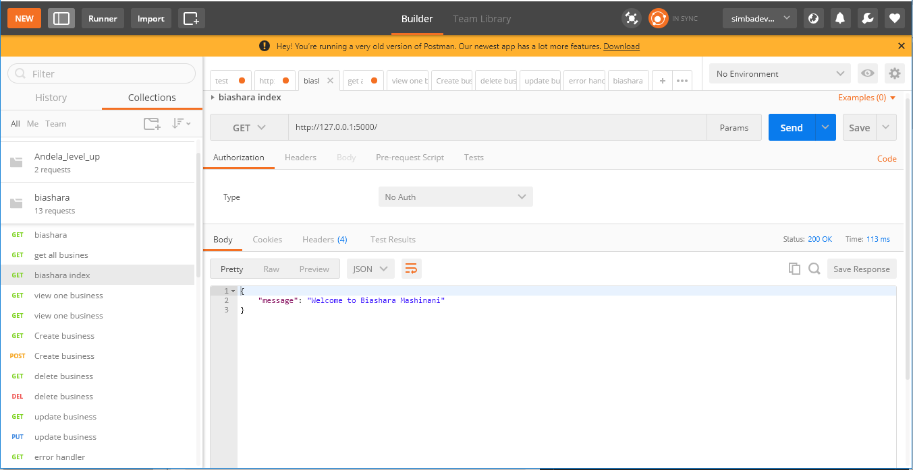
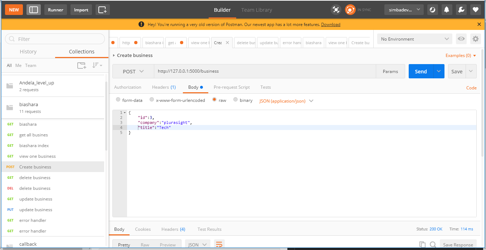
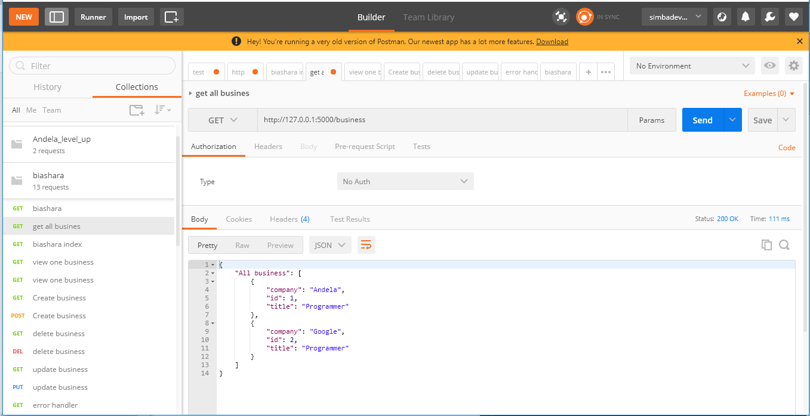
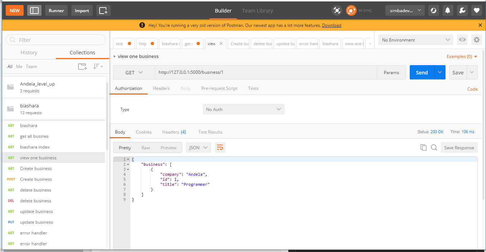
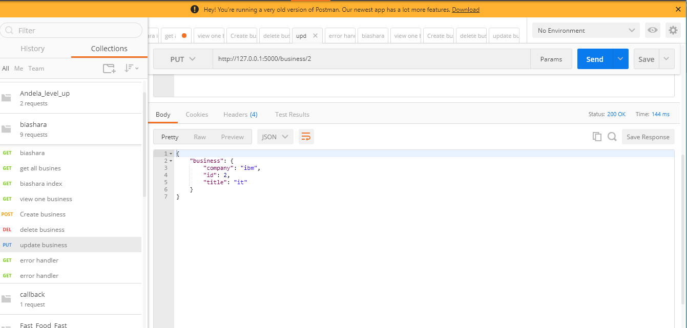
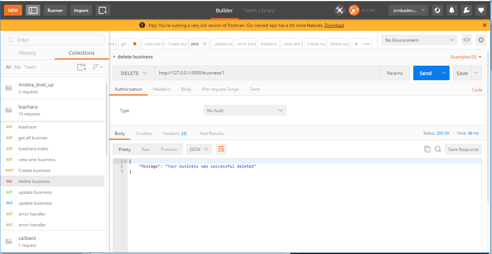
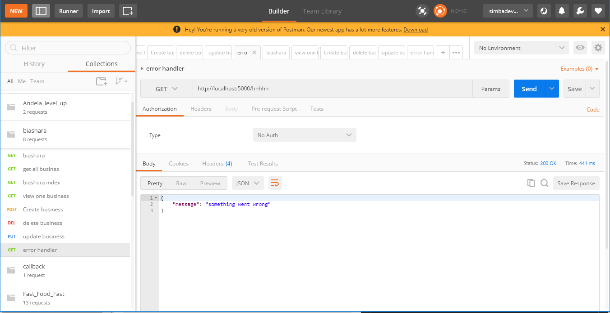

# Description
You will continue building your project by adding CRUD endpoints for a businesses model.<br>
Create the following endpoints for your project.<br>


## Tasks

```

1. POST /businesses

2. GET /businesses

3. GET /businesses/<id>

4. PUT /businesses/<id>

5. DELETE /businesses/<id>

```

## Links

[](https://app.getpostman.com/run-collection/12424cb2ad067839ccab)<br>
[Postman Test](https://www.getpostman.com/collections/12424cb2ad067839ccab)<br>
[postman Documentation](https://documenter.getpostman.com/view/4679196/RzfarX2D)

## Images
<br>
Route for index page<br><br>

<br>
Route for craeing a business<br><br>

<br>
Route for viewing all business<br><br>

<br>
Route for viewing one business using its id<br><br>

<br>
Route to update business using its id<br><br>

<br>
Route to delete a business using its id<br><br>

<br>
Route to help in handling errors<br><br>
